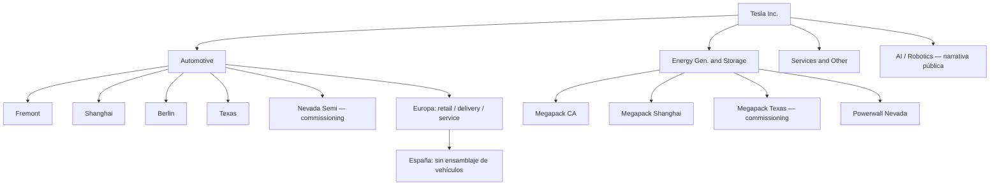

# Cómo se organiza Tesla (nivel público)

> ⚠️ Tesla **no publica** un organigrama interno detallado al estilo “quién reporta a quién en Sales España”. Este módulo describe **áreas de negocio y huella operativa visibles**, no jerarquías secretas.

```json
{
  "structure_map": {
    "version": "2026-09-04",
    "source_note": "Nodos públicos; capacidades de IR Q2 2026 Update (installed annual capacity ≠ ritmo actual).",
    "nodes": [
      {"id": "tesla", "label": "Tesla, Inc.", "type": "company", "parent": null},
      {"id": "auto", "label": "Automotive", "type": "segment", "parent": "tesla"},
      {"id": "energy", "label": "Energy Generation & Storage", "type": "segment", "parent": "tesla"},
      {"id": "services", "label": "Services & Other", "type": "segment", "parent": "tesla"},
      {"id": "ai_robotics", "label": "AI / Robotics (línea estratégica)", "type": "strategic", "parent": "tesla", "uncertain": true},
      {"id": "mfg_fremont", "label": "Fremont (California)", "type": "factory_vehicle", "parent": "auto", "products": ["Model 3", "Model Y"], "status": "production"},
      {"id": "mfg_shanghai", "label": "Giga Shanghai", "type": "factory_vehicle", "parent": "auto", "products": ["Model 3", "Model Y"], "status": "production"},
      {"id": "mfg_berlin", "label": "Giga Berlin-Brandenburg", "type": "factory_vehicle", "parent": "auto", "products": ["Model Y"], "status": "production", "region": "EU"},
      {"id": "mfg_texas", "label": "Giga Texas (Austin)", "type": "factory_vehicle", "parent": "auto", "products": ["Model Y", "Cybertruck", "Cybercab"], "status": "production"},
      {"id": "mfg_nevada_semi", "label": "Giga Nevada — Semi", "type": "factory_vehicle", "parent": "auto", "products": ["Semi"], "status": "commissioning"},
      {"id": "mfg_megapack_ca", "label": "Megafactory California (Lathrop)", "type": "factory_energy", "parent": "energy", "products": ["Megapack"], "status": "production"},
      {"id": "mfg_megapack_sh", "label": "Megafactory Shanghai", "type": "factory_energy", "parent": "energy", "products": ["Megapack"], "status": "production"},
      {"id": "mfg_megapack_tx", "label": "Megafactory Texas", "type": "factory_energy", "parent": "energy", "products": ["Megapack 3 / Megablock"], "status": "commissioning"},
      {"id": "mfg_powerwall_nv", "label": "Nevada — Powerwall", "type": "factory_energy", "parent": "energy", "products": ["Powerwall"], "status": "production"},
      {"id": "eu_retail", "label": "Europa — Stores / Delivery / Service", "type": "customer_channel", "parent": "auto", "region": "EU"},
      {"id": "es_presence", "label": "España — retail + servicio + Supercharger (sin fábrica de vehículos)", "type": "customer_channel", "parent": "eu_retail", "region": "ES"},
      {"id": "supercharger", "label": "Red Supercharger", "type": "infra", "parent": "services"}
    ]
  }
}
```

---

## Capas que sí son públicas

### 1. Negocios / segmentos (reporting)

| Área | Rol (vista cliente / IR) |
|------|--------------------------|
| **Automotive** | Diseño, fabricación, venta y entrega de vehículos |
| **Energy Generation & Storage** | Powerwall, Megapack, solar (según mercado); software de energía |
| **Services & Other** | Servicio, piezas, seguros (donde exista), merchandising, etc. |

En filings (10-K / earnings), Tesla reporta estos segmentos. Los **nombres exactos y el desglose numérico** verifícalos en el último informe — no copies cifras de memoria aquí.

### 2. Jerarquía conceptual (parseable por la UI)



---

## Manufactura — footprint conocido (público)

Fuente de capacidades: **Tesla Q2 2026 Update** (Installed Annual Manufacturing Capacity).  
> ⚠️ Capacidad instalada ≠ ritmo de producción actual.

| Planta / región | Productos (IR) | Capacidad instalada (IR Q2’26) | Estado |
|-----------------|----------------|--------------------------------|--------|
| California (Fremont) | Model 3 / Model Y | >550.000 veh/año | Production |
| Shanghai | Model 3 / Model Y | >950.000 veh/año | Production |
| Berlin-Brandenburg | Model Y | >375.000 veh/año | Production |
| Texas (Austin) | Model Y | >250.000 veh/año | Production |
| Texas | Cybertruck | >125.000 veh/año | Production |
| Texas | Cybercab | >125.000 veh/año | Production |
| Nevada | Tesla Semi | — | Commissioning |
| California (Megafactory) | Megapack | 40 GWh | Production |
| Shanghai (Megafactory) | Megapack | 20 GWh | Production |
| Texas (Megafactory) | Megapack 3 / Megablock | — | Commissioning |
| Nevada | Powerwall | >6 GWh | Production |

**Notas públicas adicionales (no inventar más):**

- Giga Berlin es la **única planta de ensamblaje de vehículos en Europa**.  
- Fremont: IR indica desmantelamiento de líneas Model S/X e instalación de líneas Optimus (construcción / inicio de producción previsto — verificar en último Update).  
- Giga México (Monterrey): anunciada históricamente; **no** figura como planta en producción en la tabla IR de capacidad — trátala como proyecto pausado / no operativo.  
- **España:** no hay fábrica de vehículos Tesla; presencia = retail + delivery + service + Superchargers.

---

## Canales al cliente (Europa / España)

Modelo típico **directo** (sin concesionario multi-marca clásico):

| Nodo | Función |
|------|---------|
| **Online** | Configuración y pedido en tesla.com |
| **Stores / Galleries** | Experiencia de producto, educación, cierre |
| **Delivery Centers / Hubs** | Preparación y entrega |
| **Service Centers + Mobile Service** | Postventa |
| **Supercharger** | Carga rápida (propia; a menudo abierta a otros según política local) |
| **Pruebas autoservicio** | Ubicaciones de test drive sin cita clásica (donde existan) |

### España — qué es público a alto nivel

- Tesla opera en España con **venta directa**, centros de entrega, servicio y Superchargers.  
- Prensa especializada (feb–abr 2026) reportó del orden de **~21 tiendas/centros de entrega**, más ubicaciones de prueba y centros de servicio (cifras **perishable**).  
- Aperturas citadas en prensa 2026: p. ej. A Coruña, Oiartzun, Rivas-Vaciamadrid; hub relevante en área Barcelona (Sabadell) — **verificar siempre** en [Find Us España](https://www.tesla.com/es_ES/findus).  
- No hay ensamblaje de vehículos a gran escala en ES.

> ⚠️ [Incierta / verificar] Cualquier conteo exacto de sedes o empleados por ciudad. Usa el localizador oficial, no este pack, como fuente de direcciones.

---

## Europa y España — qué sí / qué no sabemos

### Sí (público y estable a nivel conceptual)

- Giga Berlin produce Model Y para el mercado europeo.  
- Capacidades instaladas de las plantas principales están en el **Update trimestral** de IR.  
- Tesla opera en España con venta directa, servicio y Superchargers.  
- El cliente europeo interactúa con homologación, incentivos e impuestos distintos a EE.UU.

### No inventar

- Organigrama de “Director Regional España → N managers…”.  
- Número exacto de empleados por ciudad.  
- Capacidades “orales” o de blog sin contrastar con IR.  
- Estructura legal de filiales sin mirar registro / filings.

> 💡 Frase útil: *“A nivel público, Tesla se entiende por negocios (auto/energy/services) y por nodos (fábricas, tiendas, service, Superchargers). El detalle de reporting interno no es material de aprendizaje obligatorio.”*

---

## Roles “de tierra” (mundos operativos)

| Mundo | Qué hace en la práctica |
|-------|-------------------------|
| Sales / Experience | Educa, prueba, configura, cierra pedido |
| Delivery | Prepara coche, cita, handoff, onboarding |
| Service | Diagnóstico, reparaciones, Mobile Service |
| Energy Advisors / partners | Powerwall / solar según mercado |
| Ops / logística regional | Inventario, citas, flujo entre nodos |
| Supercharger / infra | Disponibilidad y expansión de red |

El módulo **Cómo opera** profundiza el journey del cliente.

---

## AI / robotics en la “estructura” narrativa

Tesla comunica públicamente (IR / web):

- **FSD (Supervised)** y visión / autonomía ligados al vehículo.  
- **Optimus** — líneas en Fremont/Texas en construcción según Update.  
- **Cybercab / Robotaxi** — producción / despliegue en EE.UU.; **no** es SKU retail ES.  
- Energy software (Autobidder / VPP en algunos mercados) — más B2B.

Trátalo como **líneas estratégicas públicas**, no como departamentos con headcount inventado.

---

## Checklist

- [ ] Distingo Automotive vs Energy vs Services.  
- [ ] Sé nombrar Giga Berlin como ancla europea de vehículos.  
- [ ] Sé que España = retail/servicio/carga, no fábrica de coches.  
- [ ] Sé que capacidades vienen del Update IR y no son “ritmo actual”.  
- [ ] Evito inventar organigramas.
